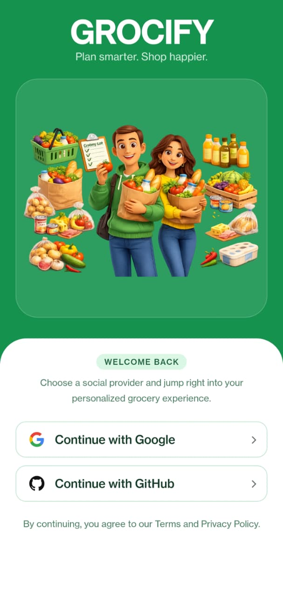
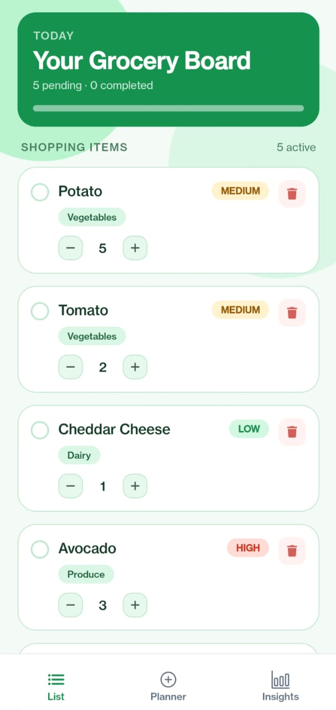
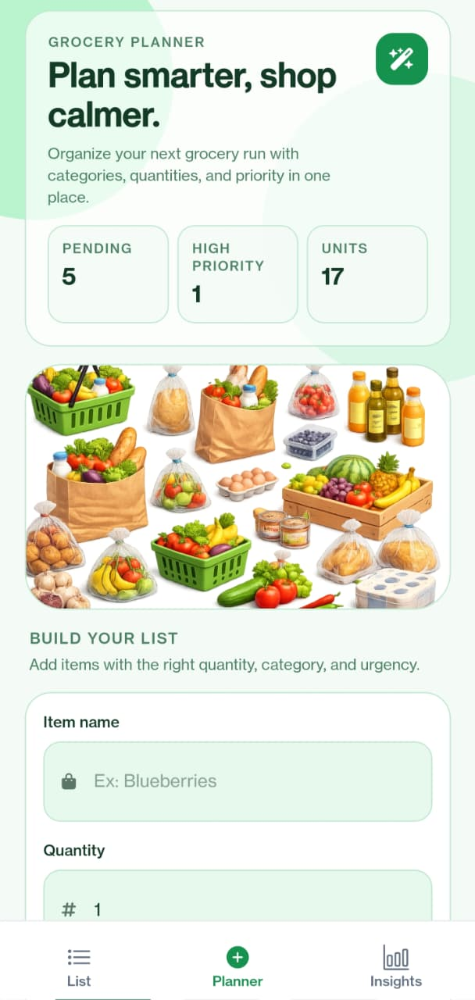
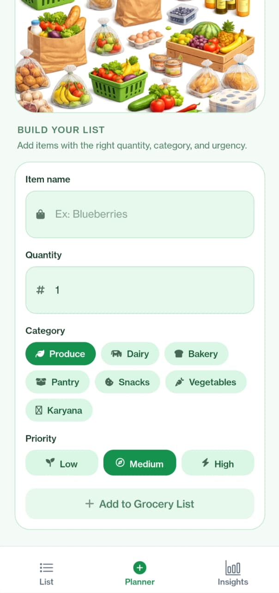
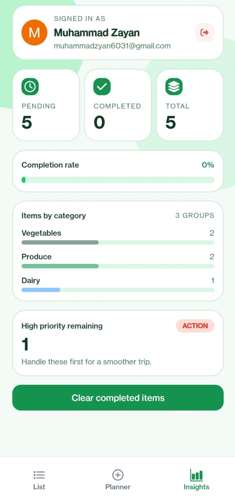

# 🛒 Grocify

A smart, minimal grocery planning app built with React Native and Expo. Plan your shopping list with categories, quantities, and priorities — all in a clean, modern interface.

<p align="center">
  
  
  
   
   
</p>

---

## ✨ Features

### 🔐 Authentication
- Secure sign-up and sign-in flow powered by **Clerk**
- Email verification on sign-up
- Persistent session handling with route-based auth protection
- Auto-redirect between signed-in and signed-out states

### 📋 Grocery List Management
- Add items with **name, quantity, category, and priority**
- Categories: Produce, Dairy, Bakery, Pantry, Snacks, Vegetables, Karyana
- Priority levels: Low, Medium, High — with color-coded visual indicators
- Mark items as purchased with a single tap
- **Clear completed items** with an animated loading state for clear feedback

### 📊 Insights
- At-a-glance stats: pending items, high-priority items, and total units
- Visual breakdown of your shopping list to help you plan smarter

### 🎨 Premium UI/UX
- Custom floating-style tab navigation with smooth active-state highlighting
- Full **light/dark mode** support that adapts automatically to system theme
- Rounded cards, soft shadows, and a cohesive color system built with **NativeWind (Tailwind CSS for React Native)**
- Keyboard-aware forms that adjust smoothly when typing

### 🗄️ Backend & Data
- **PostgreSQL** database hosted on **Neon** (serverless Postgres)
- Type-safe database queries using **Drizzle ORM**
- API routes built directly into the app using **Expo Router's API Routes**

---

## 🛠️ Tech Stack

| Category         | Technology                          |
|-------------------|--------------------------------------|
| Framework          | [Expo](https://expo.dev) / React Native |
| Navigation         | Expo Router (file-based routing)     |
| Authentication     | [Clerk](https://clerk.com)           |
| Styling            | NativeWind (Tailwind CSS)            |
| Database           | Neon (Serverless Postgres)           |
| ORM                | Drizzle ORM                          |
| State Management   | Zustand-style custom store           |
| Icons              | Expo Vector Icons (Ionicons, FontAwesome6) |

---

## 📱 Screenshots

<p align="center">
  
  
  
</p>

> 📝 Add your own screenshots to `assets/screenshots/` and update the filenames above to match.

---

## 🚀 Getting Started

### Prerequisites
- Node.js (LTS recommended)
- npm or yarn
- Expo CLI
- A Neon database (or any Postgres-compatible database)
- A Clerk account for authentication keys

### Installation

```bash
# Clone the repository
git clone https://github.com/your-username/grocify.git
cd grocify

# Install dependencies
npm install
```

### Environment Variables

Create a `.env` file in the root directory:

```env
EXPO_PUBLIC_CLERK_PUBLISHABLE_KEY=your_clerk_publishable_key
DATABASE_URL=your_neon_database_url
```

### Running the App

```bash
# Start the development server
npx expo start
```

> ⚠️ Some native features (e.g. native tabs, keyboard handling) require a **custom development build** rather than Expo Go. See [Expo's dev client docs](https://docs.expo.dev/develop/development-builds/introduction/) for setup instructions.

To build a development client:

```bash
npx expo prebuild --clean
npx expo run:android   # or npx expo run:ios
```

---

## 📂 Project Structure

```
grocify/
├── app/                    # Expo Router screens & layouts
│   ├── (auth)/              # Sign-in / sign-up flow
│   ├── (tabs)/               # Main app tabs (List, Planner, Insights)
│   └── api/                  # Server API routes
├── components/              # Reusable UI components
├── store/                    # App state management
├── lib/                       # Server utilities, DB client & schema
└── assets/                   # Images, icons, and screenshots
```

---

## 🧭 Roadmap

- [ ] Shared/collaborative grocery lists
- [ ] Price tracking per item
- [ ] Reorder suggestions based on shopping history
- [ ] Push notifications for reminders

---

## 📄 License

This project is currently private and not licensed for public distribution.

---

## 🙌 Acknowledgements

Built with ❤️ using Expo, Clerk, and Neon.
